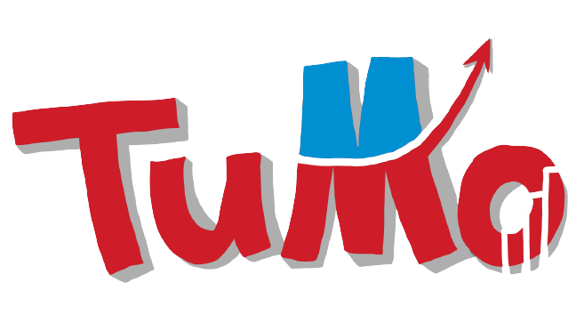

# Tumo: 투자를 모으다

> 프로젝트 기간 : *2021.7.12(월) ~ 2021.8.20(금)*

### 🎉 Intro

- [기획 발표 자료 (한 눈에 보기)](https://docs.google.com/presentation/d/1BUmCPjD3nl1hnQS8ZTmICsX9RWJ3C3JC3V0X5G1RN9A/edit#slide=id.ge68eb2bfc9_3_57)
- [최종 발표 자료 (한 눈에 보기)](https://docs.google.com/presentation/d/1Ampp3iAXb_XsJrdF6NKmZDbUUKHwQhe3_daI1qt7mm0/edit#slide=id.ge81ccc57a0_0_9)
- UCC

### 👩‍👦‍👦 TEAM

- **팀장** 이규정 : 프론트엔드, Jira 및 발표
- **팀원** 권용인 : 백엔드, UCC
- **팀원** 박종대 : 백엔드, UCC
- **팀원** 안동준 : 프론트엔드, 산출물 관리
- **팀원** 이다솜 : 백엔드, 산출물 관리

### 📣 서비스 소개

- **URL** - https://i5a302.p.ssafy.io/
- **이름** : **투모 : 투자를 모으다. (TUMO)**
- **내용** : 투자 정보 공유 SNS

### 📃 기획

- **의도**

  - 현재 대한민국은 주식 열풍! (빚투, 영끌, 동학개미운동)
  - 개인 투자자들의 투자 관심 증가 그 결과, 코스피 3000 등의 이례적인 기록
  - 하지만 여전히 어려운 투자
    - 분산된 정보
    - 방대한 정보
    - 공신력 등의 문제점
  - 위 어려움을 극복하고 투자 정보를 공유할 수 있는 플랫폼의 필요성 인지
  - 주 타겟층을 MZ 세대로 한 젊은 감성, 편리한 UI를 갖는 서비스 제공

  

- **내용**

  MZ 세대 110명 대상 설문 조사 실시, 해당 결과에서 인사이트를 도출하고 주요 기능 구상함

  - 설문 URL

  - 설문 결과

    - 투자 관심도

    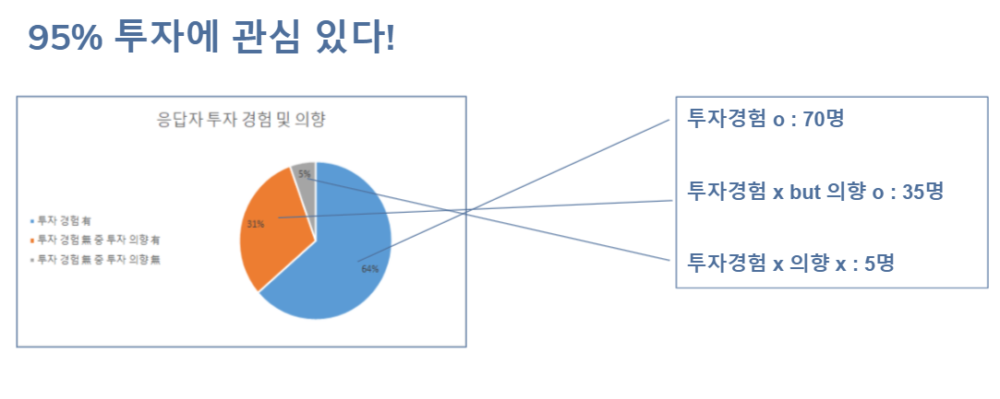

    - 정보 수집 경로

    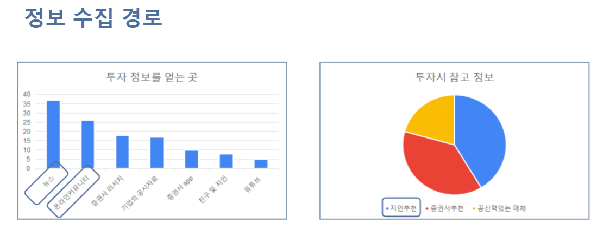

    - 정보 수집 시 어려움

    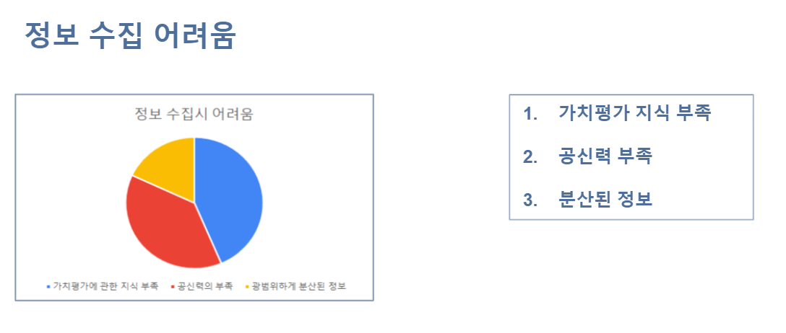

- **목표**
  - 개인 투자자들이 자유롭게 정보를 공유할 수 있는 플랫폼 **(커뮤니티)**
  - 분산된 정보를 한 곳에서 확인할 수 있는 플랫폼 **(뉴스, 공시 정보)**
  - 실제 투자 수익률을 계산해 제공함으로써 능력있는 투자자의 정보를 확인 **(공신력)**

### 🔨 설계

- **Wire Frame**

  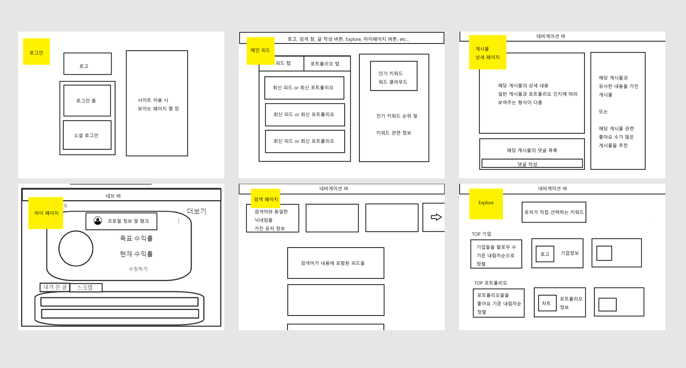

- **ERD**

  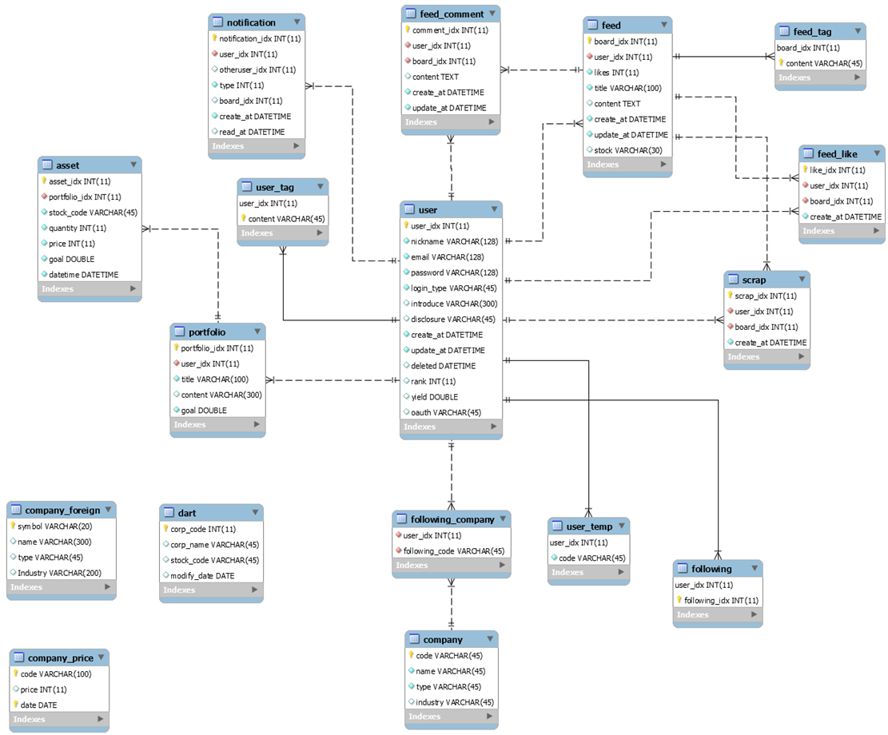

- **Prototype**

  Figma를 이용하여 제작한 서비스 프로토 타입

  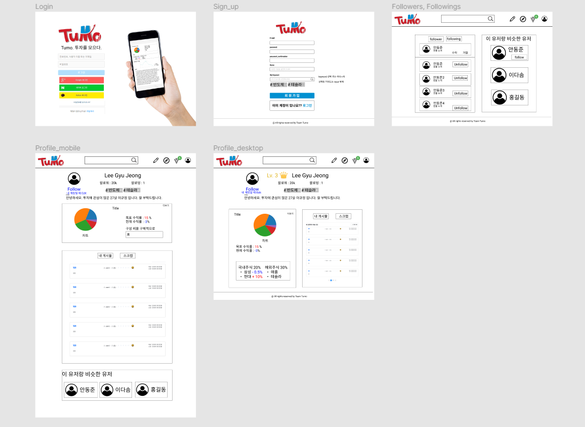

  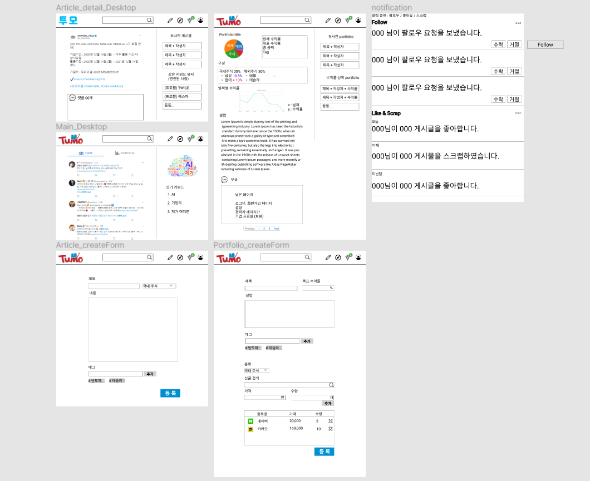

## 👨‍🔧👩‍🔧 개발

### **개발환경**

**FE**

- Vue.js (Vue2)
- Vuex 3.6.2
- Vue router 3.5.2
- Vuetify, [Element.io](http://Element.io), Chart.js, Tiptap (HTML editor), Infinite Loading ....

**BE**

- Spring Boot (STS 3.9.14)
- Java 8 (openjdk version 1.8.0_192)
- MariaDB 10.5.11

**Deployment**

- AWS EC2
- Docker 20.10.7
- GitLab Runner

### 주요 기능

- **젊은 감성의 투자 SNS**
- **소셜 로그인**
  - 구글 OAuth를 이용하여, 소셜 로그인 기능 제공
  - 서비스의 접근성 증대
- **랭킹 시스템**
  - 주기 (1주일) 별로 유저의 포트폴리오 수익률을 통해 랭킹을 계산
  - 골드 / 실버 / 브론즈
  - Gamification 전략의 일환으로 유저의 참여를 이끔
  - 실제 투자 정보를 이용하여 정보의 공신력을 높임
- **기업 정보 제공**
  - Dart Open API를 이용하여 공시 정보 중 재무 정보를 출력함
    - ex) 매출액, 당기손익, 유동비율, ROE 등등
  - 네이버 뉴스 검색 API를 이용하여 개별 기업들의 실시간 뉴스 제공
- **포트폴리오 관리**
  - 크롤링을 통해 개별 주식들의 실시간 가격 정보 반영
  - 이를 통해 전체 포트폴리오의 수익률 도출
  - 전체 자산 중 개별 자산들의 포션을 제공
- **피드**
  - Infinite scroll 기능을 활용하여 UX 개선에 힘씀
  - 포폴 / 게시글 두 가지 탭을 이용한 UI 구축
- **추천 시스템**
  - 회원 가입 시 관심 키워드 (태그)를 설정하여 유사한 게시글 추천
  - Explore에서 해당 키워드와 관련된 포트폴리오를 출력함

### 배포

- AWS EC2

  Spring Boot 및 Vue.js 프로젝트 배포

- GitLab Runner CI/CD를 이용

  master 브랜치에 merge 및 push 할 경우, (웹페이지)[https://i5a302.p.ssafy.io/]에 자동 배포

### TUMO 주요 기능 상세

#### 1. 소셜 로그인 (Google)

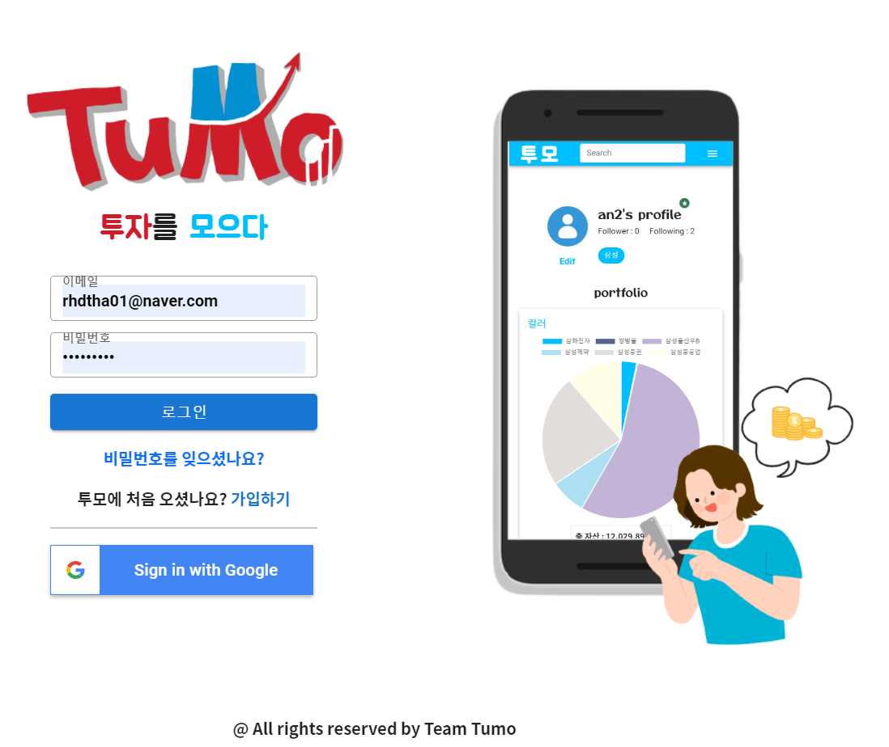

- 서비스의 접근성을 높이고자, Google의 OAuth 사용하여 구글 아이디로 로그인할 수 있도록 하였다.

#### 2. 인기키워드 (feat. 워드 클라우드)

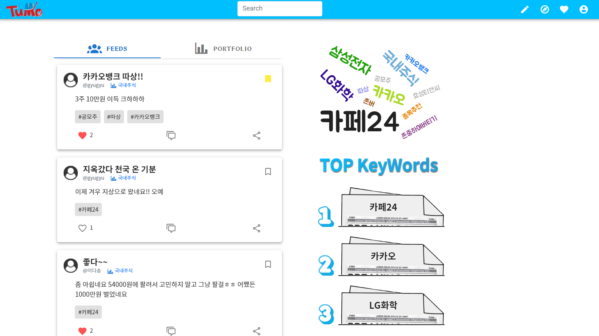

- TUMO에 존재하는 게시물의 태그 개수를 기준으로 TOP Keyword를 선정하고 이를 워드 클라우드로 시각화
- 상위 3개의 키워드를 우측 하단에 보여주고 해당 키워드가 적힌 신문 이미지를 클릭 시 바로 해당 키워드를 검색한 결과 페이지로 이동할 수 있도록 제작

#### 3. 게시물 스크랩

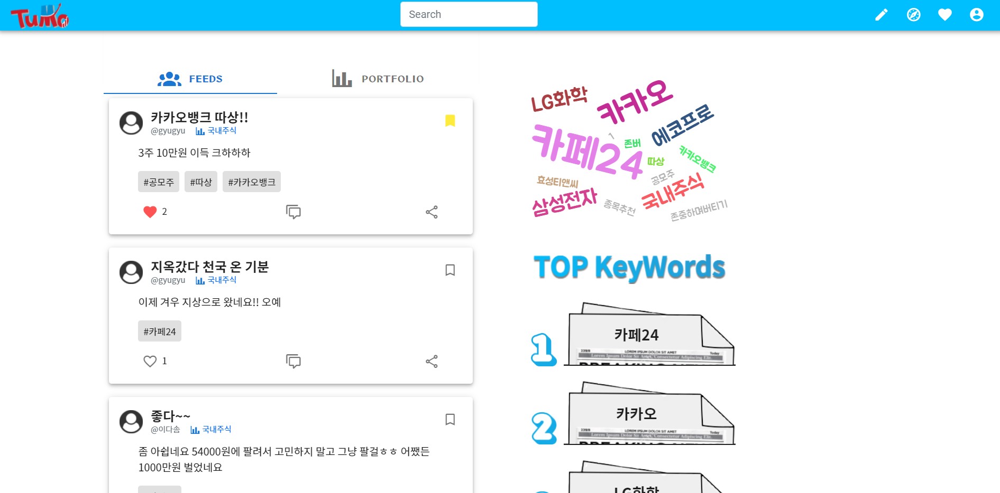

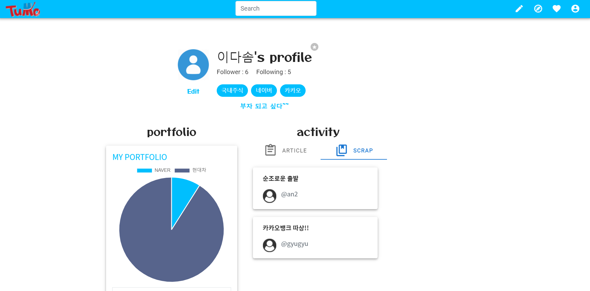

- 각 게시물을 스크랩 할 수 있고 마이 프로필에서 유저가 스크랩한 게시물들을 한눈에 조회 가능
- 방대한 자료 취합의 어려움을 일부 해소 가능할 것으로 기대

#### 4. 관련 게시물 추천

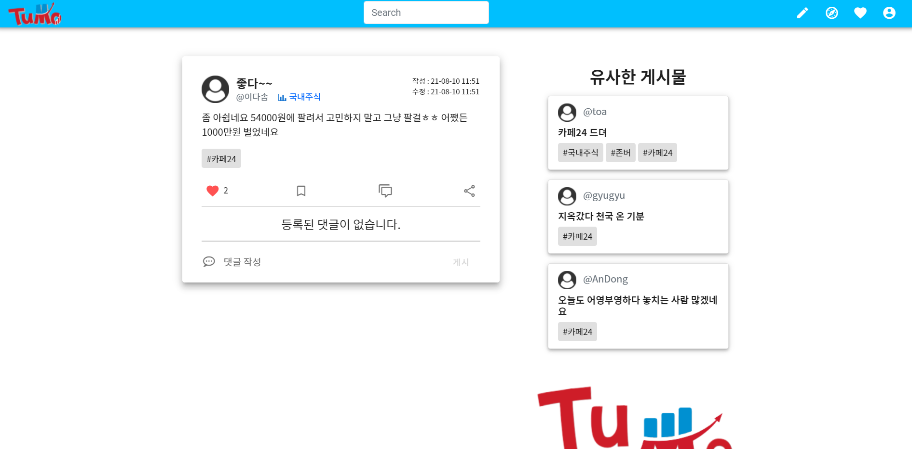

- 현재 보고 있는 게시물과 연관된 (해쉬태그가 동일한) 게시물들을 추천하는 기능을 제공
- 사용자가 원하는 내용과 관련된 수많은 정보를 쉽게 접근할 수 있도록 설계

#### 5. 다양한 기업 정보, 기업 최신 뉴스 및 보고서

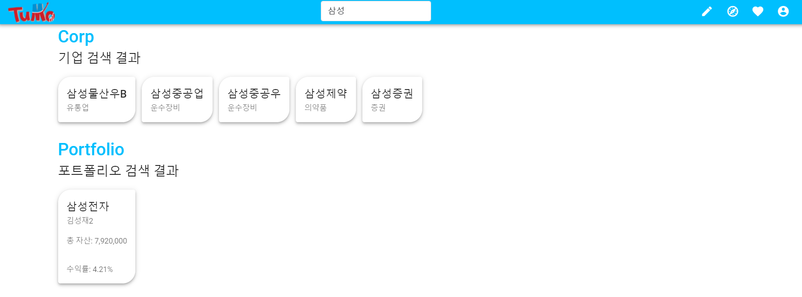

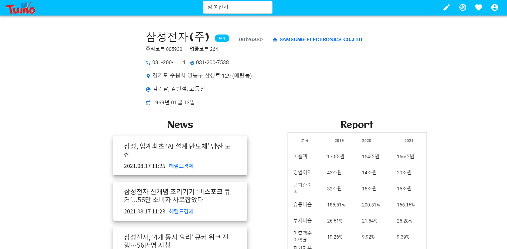

- 다양한 기업들의 기본적인 정보와 최신 뉴스, 최신 보고서를 제공
- 사용자들이 선택한 기업만의 정보들을 쉽게 접근

#### 6. 나만의 포트폴리오

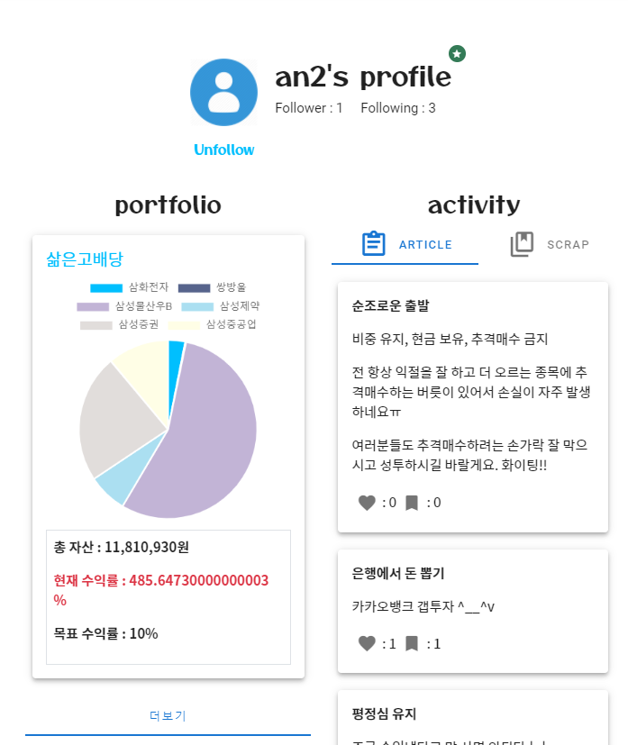

- 프로필 페이지에서 사용자의 대표 포트폴리오를 조회 가능

  

#### 7. 해시 태그 기반 포트폴리오 추천

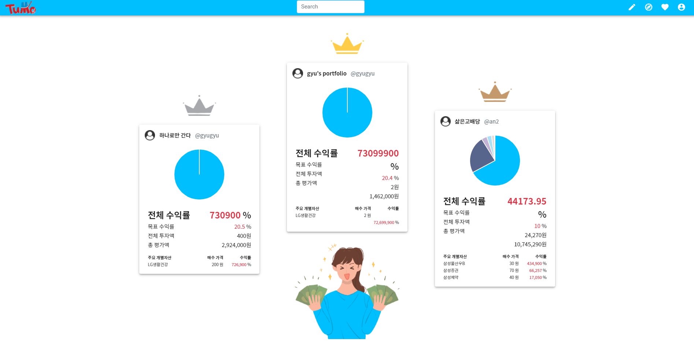

- 사용자 회원정보에 입력되어 있는 관심 키워드(해시 태그) 기반 수익률이 가장 높은 3개의 포트폴리오를 추천해 주는 사용자 맞춤 기능이 제공
- 만약 회원가입 시 태그 입력을 하지 않은 경우나 관심 있는 키워드가 없는 경우 전체 포트폴리오 중에서 수익률 상위 3개를 추천

#### 8. 모의 투자

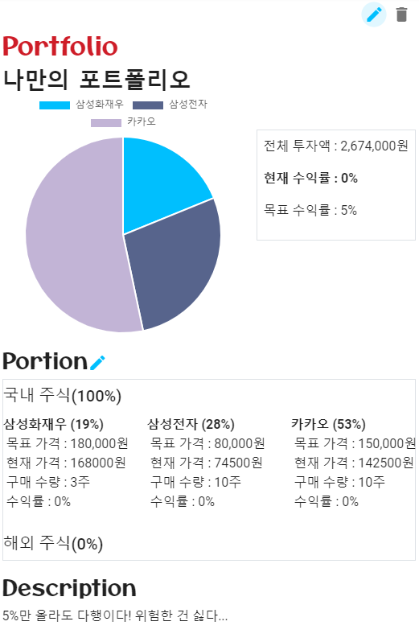

- 포트폴리오 게시물 제작 시 실제 사용자가 투자한 정보를 바탕으로 작성될 수도 있겠지만, 사용자가 임의로 개별자산 항목들을 입력함으로서 모의투자로 사용될 수도 있도록 제작

#### 9. Gamification

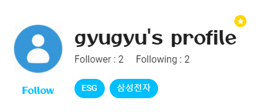

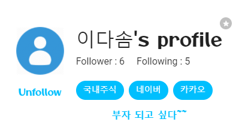

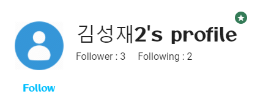

- 사용자가 작성한 포트폴리오들의 수익률을 기반으로 유저들의 랭크를 산정해 골드, 실버, 브론즈로 나눠 Gamification의 요소를 적용

#### 10. 반응형 지원

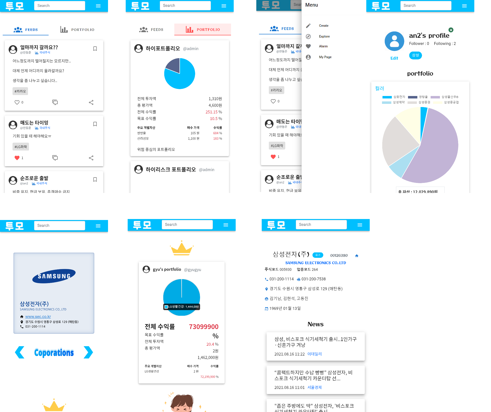

- Tumo를 모바일에서도 이용 가능하도록 모바일 display 환경에 맞는 프론트도 반응형으로 제작

## 후기

> 기억에 남는 이슈나 프로젝트 전반에 대한 소감 적어주세요

