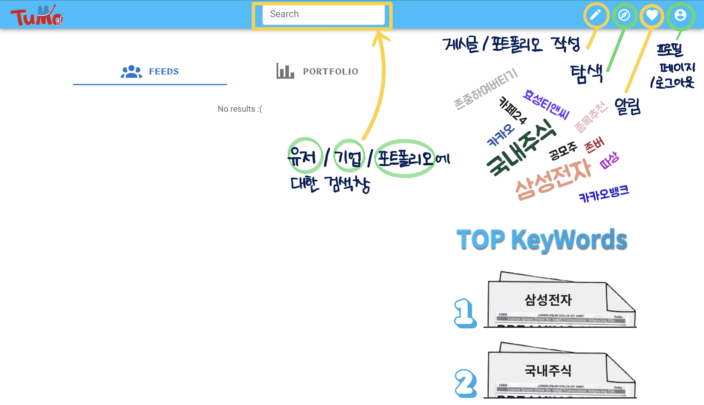

# exec) 4. 시연 시나리오

## 시나리오

### 로그인 절차

- 회원가입 → 이메일 인증 → 로그인 → 메인 피드
- 구글 로그인 → 메인 피드

### SNS 기본

탐색, 팔로우, 좋아요, 댓글, 알림 등 sns 기본 기능

- 메인 페이지에서는 유저 본인과 유저가 팔로우한 타 유저들의 피드와 포트폴리오를 조회할 수 있습니다.
- 유저 검색 → 유저 프로필 (Rank, 활동) → 팔로우 → 메인 피드

    

    - 조회 계정이 공개 계정일 경우

        

        

    - 조회 계정이 비공개 계정일 경우

        

        

        

        

        

        

- 타 유저 팔로우 후 메인피드

    

- 좋아요/스크랩, 댓글 달기 좋아요 및 스크랩 보류

    

- 알림센터

    

### 탐색

- 탐색 → 기업 디테일 or 포트폴리오 디테일
    - 기업

        

        

    - 포트폴리오

        

        

### 유저

- 회원 정보 수정 및 탈퇴

    

    

    

### 기업 정보

- 기업 검색 → 기업 디테일 → 뉴스/보고서

    

    

### 포트폴리오 관리

- 포트폴리오 피드 → 포트폴리오 디테일
- 포트폴리오 CUD

    

    

    

    

첫 화면

인증되지 않은 이용자의 첫 화면

