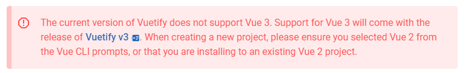

### 2021.07.19

- **개발환경 설정**

  - Vue 2

    - Vuetify는 Vue 3 를 support 하지 않음

       

  - Vue-router

  - Vuex

    - state, mutation, actions 각각 js파일로 분리

  - Vuetify

  

- **Convention**

  - views의 component들은 PascalCase
  - components의 component들은 camelCase
  - 부모 component의 자식 components들은 부모 component와 동일한 이름을 가진 폴더 내에 위치

- **소스 코드**
  - 생성 시 만들어지는 components들 초기화 (전부 삭제)
  - state, mutation, actions 각각 js로 분리
